## Репозиторий с заданиями с ELearn

### Тестирование

Сделал тестирование на doctest и модульных тестах.

5 методов протестировано в файле `main.py`.
3 метода протестировано _доктестами_, 2 метода ― _модульными тестами_.
Все пограничные случаи учтены.

#### doctests
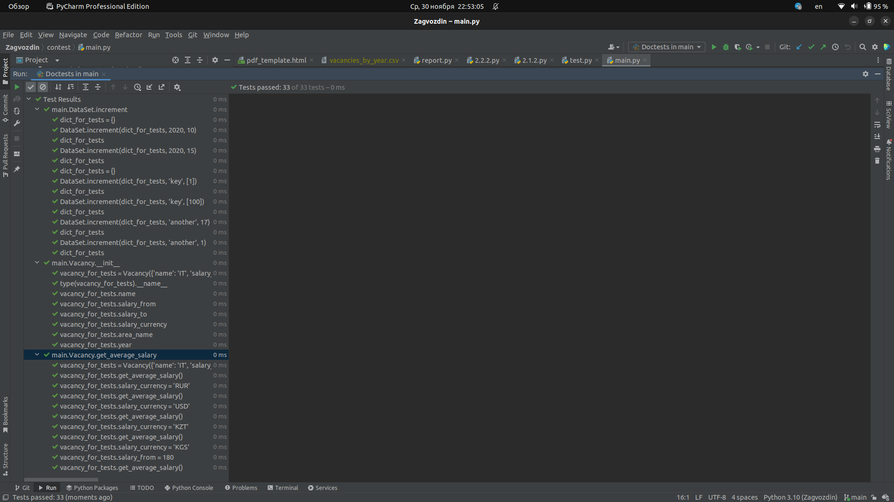

#### Модульные тесты
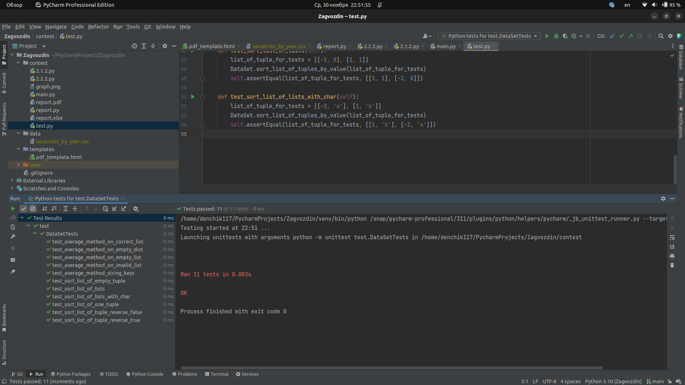

### Профилирование

Сделал профилирование 6 методов для обработки сырой даты в формат `dd.mm.YYYY`.
По итогам профилирования самым эффективным и быстрым методом оказался `fourth_date_parser()`.
Остальные методы закомментировал, оставил только самый эффективный.
Результаты профилирования прикрепляю ниже.

#### first_date_parser()
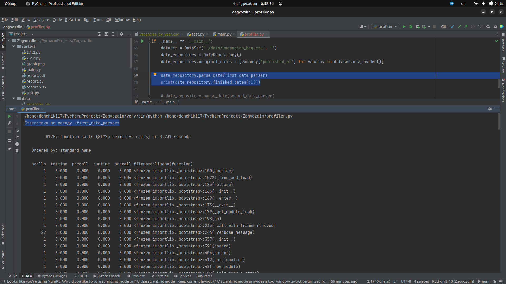

#### second_date_parser()
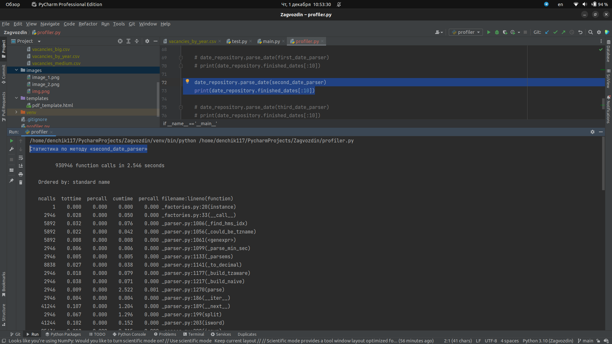

#### third_date_parser()
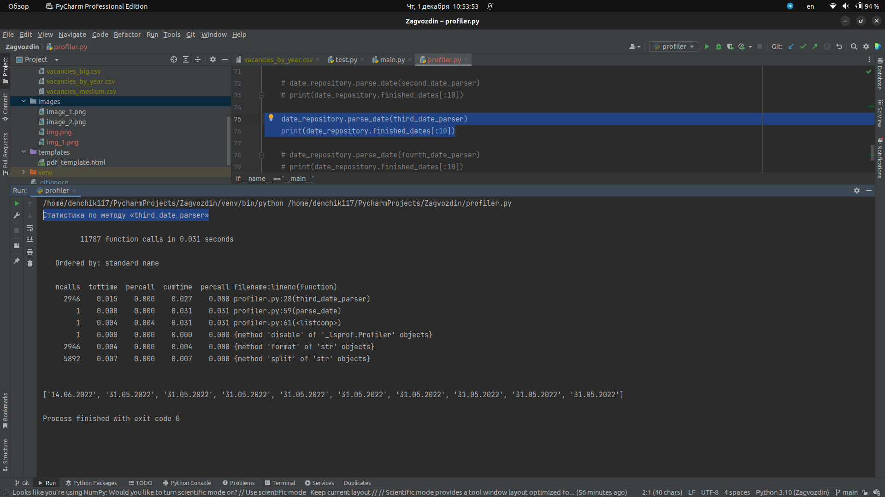

#### fourth_date_parser()
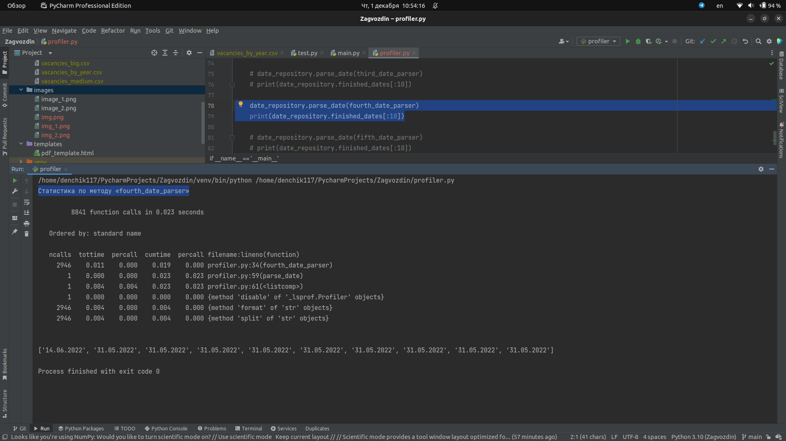

#### fifth_date_parser()
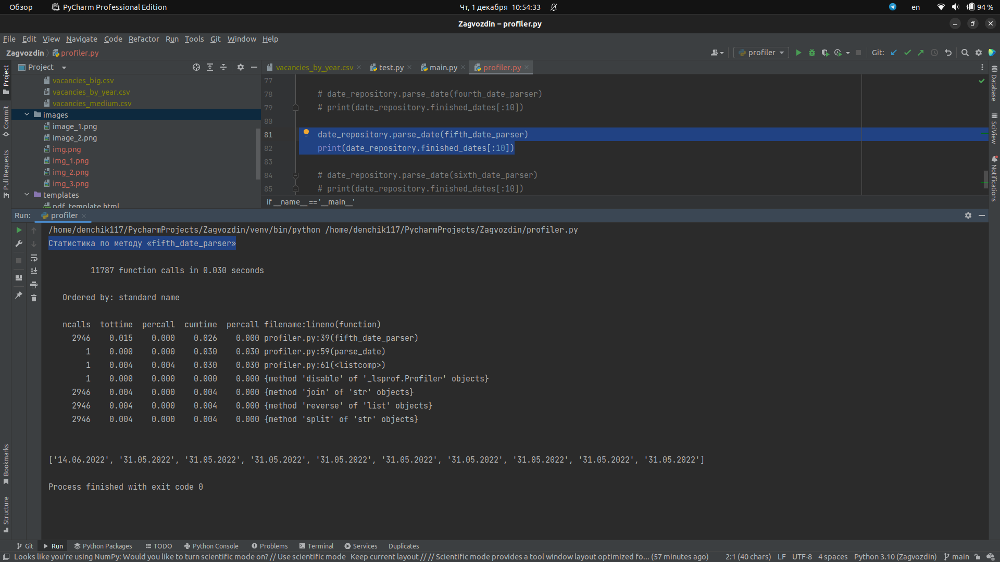

#### sixth_date_parser()
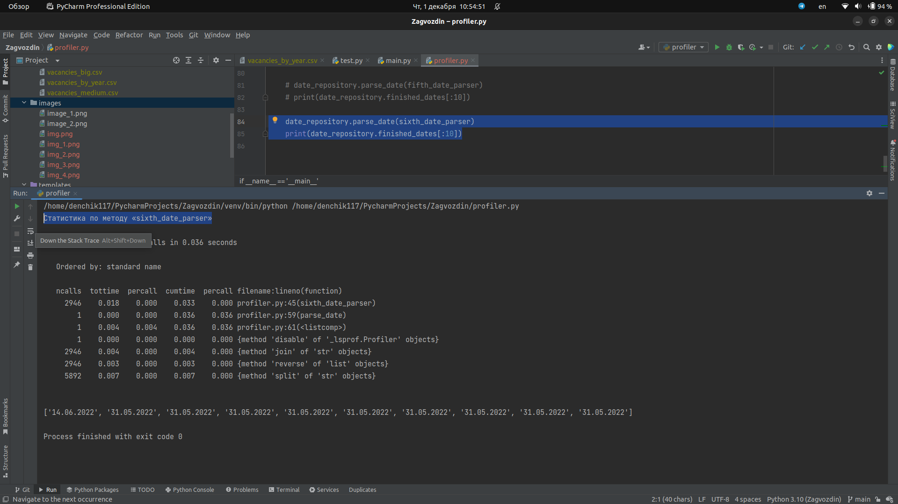

### Разделение одного большого CSV-файла на чанки
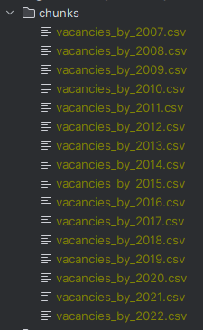

### Многопроцессорная обработка

#### Без многопроцессорной обработки
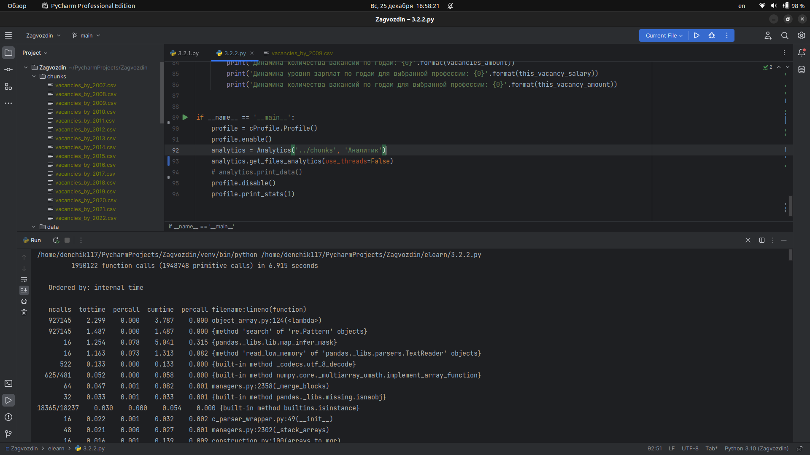

#### Multiprocessing
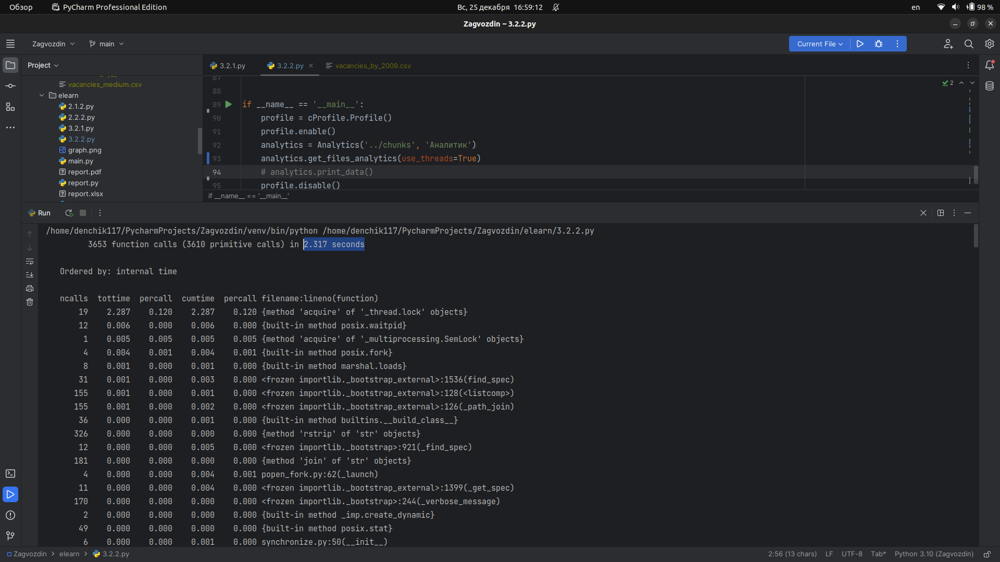

#### concurrent.futures
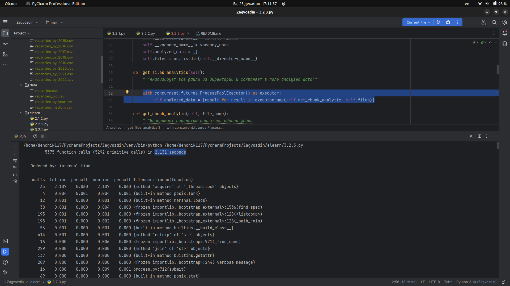

### Курсы валют

#### Частотность, с которой встречаются различные валюты
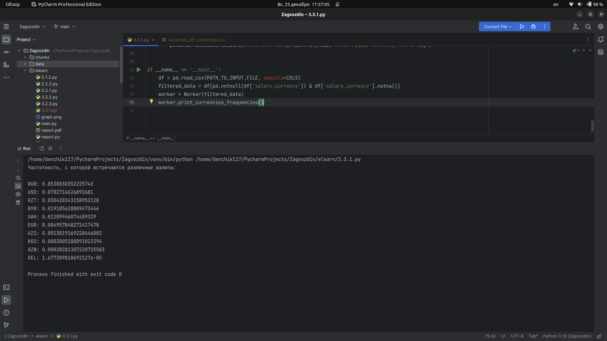

#### Полученный DataFrame в CSV формате 
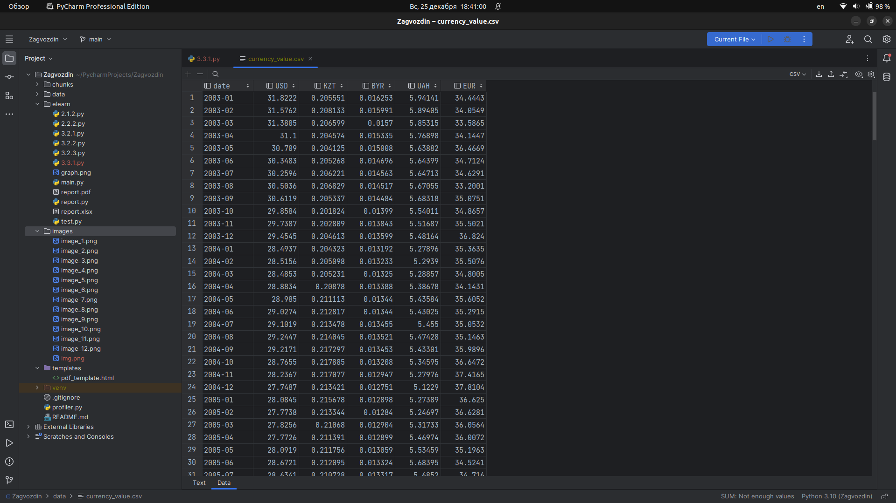

### Конвертация валют

#### Первые 100 результатов в формате CSV

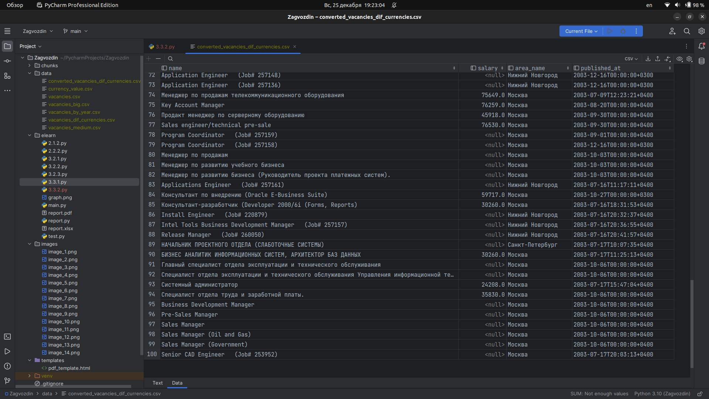

### Курсы валют в БД

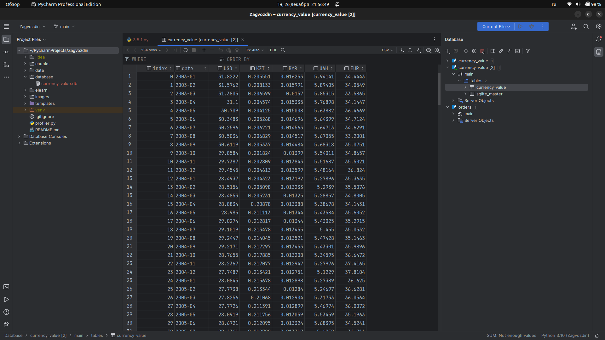

### Вакансии в БД

Примечание. Для экономии места и ресурсов операции делал только для первых 100 записей.

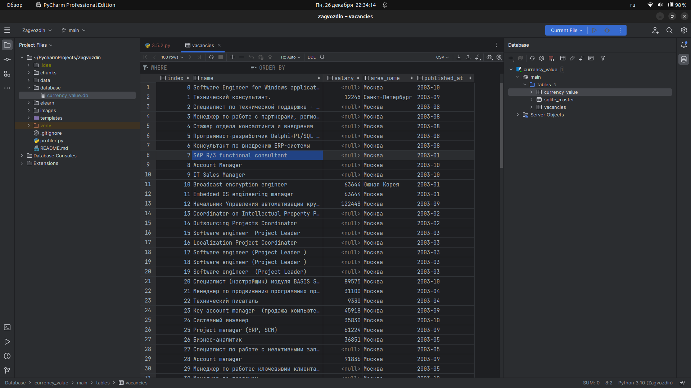